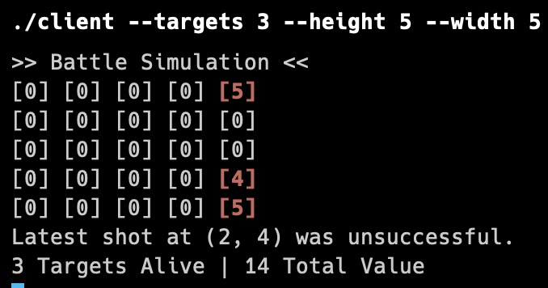
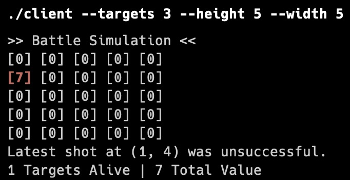
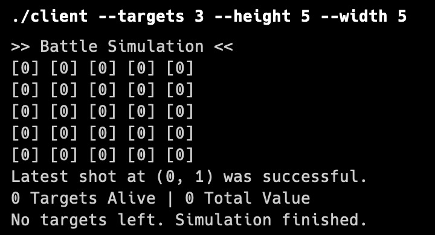

# Критерий 4-5

#### Описание задачи
В этой задаче мы моделируем симуляцию сражения между двумя клиентами. Каждая сторона имеет игровое поле с случайно расположенными целями, каждая из которых имеет свою стоимость. Клиенты стреляют друг по другу, стараясь поразить цели оппонента. Сервер выступает в роли посредника, координирующего обмен информацией о выстрелах между клиентами.

### Сущности
1. **Клиенты:**

- Клиенты имеют свои игровые поля с целями.
- Клиенты отправляют и получают координаты выстрелов через сервер.
- Клиенты асинхронно стреляют друг по другу.
2. **Сервер:**

- Сервер принимает подключения от клиентов.
- Сервер пересылает координаты выстрелов от одного клиента к другому.
- Сервер управляет обменом данными между клиентами.
3. **Цели:**

- Размещены на игровом поле клиентов.
- Имеют координаты и стоимость.
- Цели могут быть поражены выстрелами.

### Взаимодействие между сущностями
1. **Инициализация:**

- Сервер запускается и начинает прослушивать порт для входящих подключений.
- Первый клиент запускается, генерирует свои цели и подключается к серверу.
- Второй клиент запускается, генерирует свои цели и подключается к серверу.
- Когда оба клиента подключены, сервер начинает симуляцию.

2. **Передача данных:**

- Каждый клиент отправляет информацию о своих целях и поле на сервер при подключении.
- Сервер фиксирует подключение клиентов и данные об их полях и целях.

3. **Процесс симуляции:**

- Клиенты асинхронно (с случайными интервалами от 1 до 5 секунд) генерируют координаты выстрелов и отправляют их на сервер.
- Сервер получает координаты выстрела от клиента и пересылает их другому клиенту.
- Клиент, получивший координаты выстрела, проверяет, поражена ли цель, и отправляет результат обратно на сервер.
- Сервер пересылает результат выстрела первому клиенту. 
- Клиенты обновляют свои поля и выводят текущую информацию о состоянии поля, результатах выстрелов и оставшихся целях.

4. **Завершение симуляции:**

- Симуляция продолжается до тех пор, пока у одного из клиентов не закончатся цели.
- Когда у клиента заканчиваются цели, он уведомляет сервер об этом.
- Сервер прекращает пересылку данных и завершает соединения.

### Кастомизация
Для запуска сервера:
```sh
./server [--port <port>]
```
Для запуска клиента:
```sh
./client --targets <K> --height <h> --width <w> [--server-ip <ip>] [--server-port <port>]
```

### Использование
Собрать:
```sh
gcc -o server server.c -lpthread && gcc -o client client.c -lpthread
```

Запустить сервер:
```sh
./server
```

Запустить клиенты:
```sh
./client --targets 3 --height 5 --width 5
```
```sh
./client --targets 3 --height 5 --width 5
```

Запустится симуляция. Поле будет обновлятся автоматически.

### Скриншоты
Начало симуляции:


На втором клиенте уничтожены 2 цели:


Симуляция завершена:


По окончании работы серверного приложения (вроде как даже аварийного Ctrl + C) оба клиентских приложения автоматически завершаются.