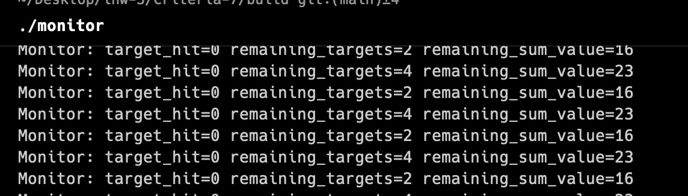

# Критерий 6-7
Добавили клиент-монитор. 

Запуск в порядке сервер -> клиент -> клиент2 -> монитор

Пример логов:

### Реализация мониторинга
#### Внесенные изменения в серверную часть
Для поддержки мониторинга были внесены следующие изменения в файл server.c:

1. Добавление дополнительного порта для мониторинга:

- Определен порт по умолчанию для мониторинга (MONITOR_PORT), который используется для подключения клиентской программы мониторинга.

2. Изменение структуры client_info:

- Добавлено новое поле monitor_socket для хранения сокета мониторинга.

3. Изменение функции parse_arguments:

- Добавлена поддержка аргумента --monitor-port для задания порта мониторинга.

4. Изменение функции client_handler:

- Теперь все сообщения от клиентов пересылаются не только другому клиенту, но и на мониторинговый сокет, если он установлен.

5. Обновление основной функции main:

- Настроена логика для прослушивания и принятия соединений на мониторинговом порту.
- Обработка подключения мониторингового клиента и создание сокета для него.

#### Мониторинговый клиент
Создан новый файл monitor_client.c, реализующий клиентскую программу для мониторинга:

- parse_arguments: Парсит аргументы командной строки для получения IP-адреса сервера и порта мониторинга.

- main: Основная функция, которая настраивает соединение с сервером, принимает и выводит все сообщения, поступающие от сервера.